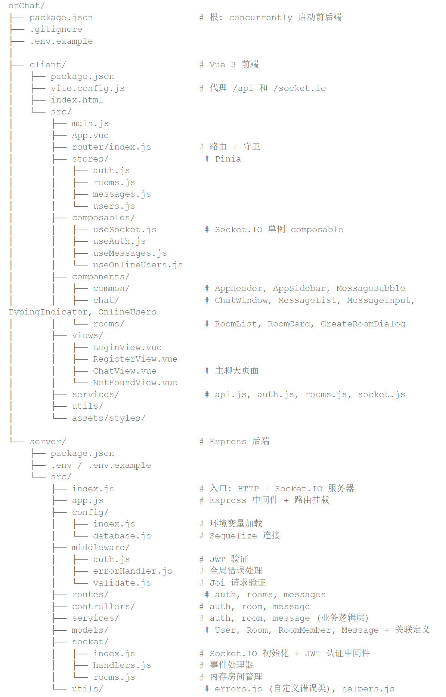
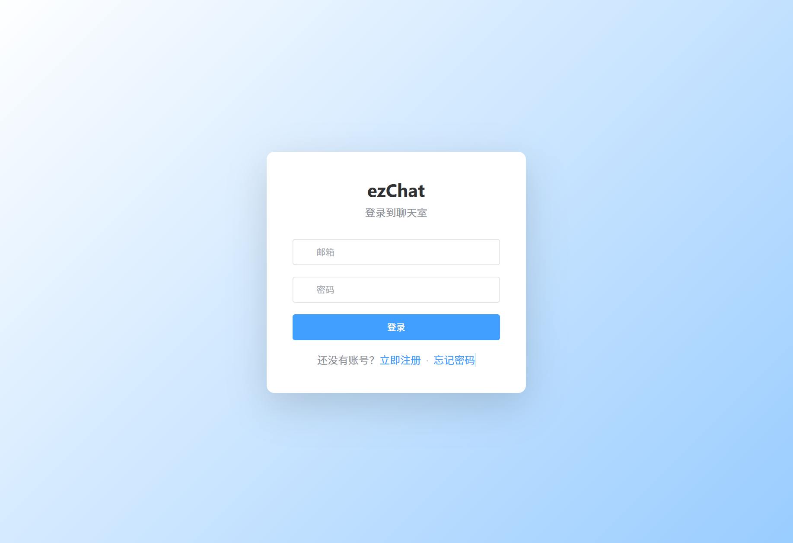
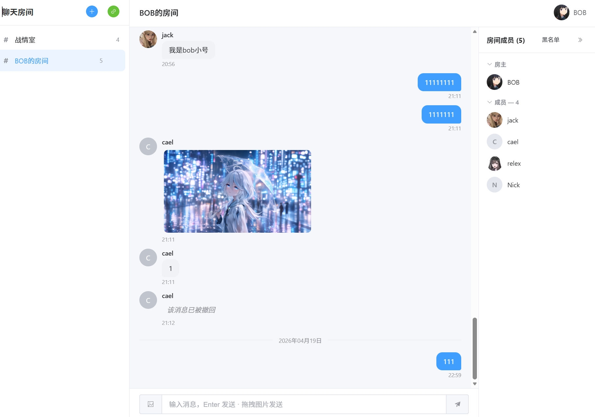
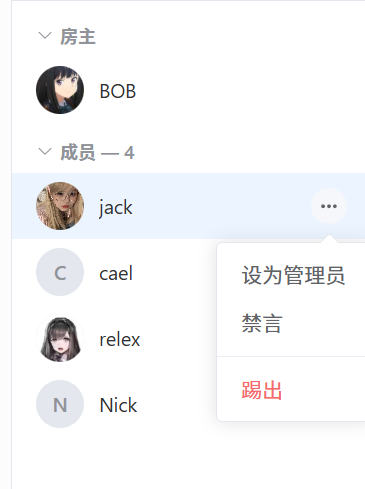
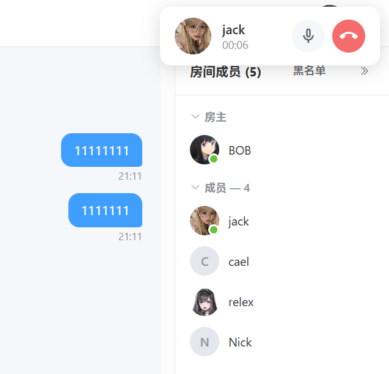
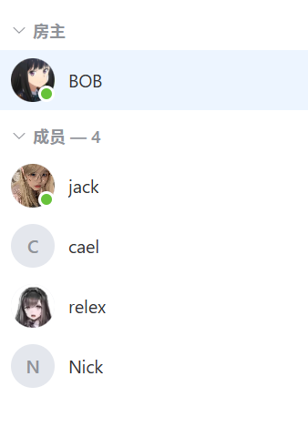

__课 程 实 践 报 告__

| 学 院： | 珠海科技学院计算机学院 |
| --- | --- |
| 专业名称： | 软件工程 |
| 设计科目： | 数据结构课程实践 |
| 学号姓名： | 04241624 谢模彦 |
| 指导教师： | 李泽熙 |
| 完成时间： | 2026.4.15 |

 

目录

__[1](#_Toc190782406)____[题目](#_Toc190782406)__[	3](#_Toc190782406)

__[2](#_Toc190782407)____[详细分析](#_Toc190782407)__[	3](#_Toc190782407)

__[2.1](#_Toc190782408)____[需求分析](#_Toc190782408)__[	3](#_Toc190782408)

__[2.2](#_Toc190782409)____[数据结构和算法说明](#_Toc190782409)__[	3](#_Toc190782409)

__[2.3](#_Toc190782410)____[设计思路](#_Toc190782410)__[	3](#_Toc190782410)

__[2.4](#_Toc190782411)____[类/接口/函数设计](#_Toc190782411)__[	4](#_Toc190782411)

__[2.5](#_Toc190782412)____[类/接口/函数关系](#_Toc190782412)__[	4](#_Toc190782412)

__[3](#_Toc190782413)____[程序实现](#_Toc190782413)__[	4](#_Toc190782413)

__[3.1](#_Toc190782414)____[核心代码说明](#_Toc190782414)__[	4](#_Toc190782414)

__[3.2](#_Toc190782415)____[程序运行](#_Toc190782415)__[	4](#_Toc190782415)

__[4](#_Toc190782416)____[测试与分析](#_Toc190782416)__[	4](#_Toc190782416)

__[5](#_Toc190782417)____[结论与心得](#_Toc190782417)__[	5](#_Toc190782417)

__[6](#_Toc190782418)____[参考资料](#_Toc190782418)__[	5](#_Toc190782418)

1. __题目__

在线聊天室是一个实时交流平台，用户可以轻松注册账号并登录系统，享受便捷的聊天服务。注册时，用户需提供基本信息如用户名、密码和邮箱，系统会对信息进行验证，确保账号安全。登录成功后，用户可以进入聊天室，发送各种类型的消息，包括文本、图片、表情等，系统会实时显示消息发送状态，确保信息及时传达。聊天室还支持私聊和群聊功能，用户可以自由选择与特定对象进行私密对话，或加入群组与多人交流，系统会根据用户选择自动切换聊天模式，保证聊天的灵活性和私密性。此外，用户可以随时查看聊天记录，系统会自动保存聊天记录，方便用户回顾历史对话，增强交流的连贯性和体验感。

1. __详细分析__
	1. __需求分析__

本系统面向校园或小团队的即时沟通场景，核心目标是提供一个可独立部署、易于扩展的开源聊天应用。结合实际调研与项目需求，主要业务需求如下：

（1）账户与身份：用户可通过用户名、邮箱、密码完成注册；登录后系统颁发 JWT 令牌，后续 HTTP 与 WebSocket 请求均凭此令牌完成鉴权；用户可上传不超过 2MB 的 JPG/PNG/GIF/WEBP 头像，头像变更会实时同步到所有聊天窗口与成员列表。

（2）房间与角色：用户可创建公开或私密房间；公开房间任何人可直接加入，私密房间需凭 8 位邀请码加入；房间创建者自动成为房主（owner），房主可任命管理员（admin），形成 owner > admin > member 的三级权限模型。

（3）成员治理：房主与管理员可对低级别成员执行禁言、踢出操作，踢出的同时自动加入该房间黑名单；被拉黑用户即便获得邀请码也无法再次进入；只有房主可查看与解除黑名单，形成完整的闭环治理。

（4）实时通讯：登录后客户端通过 Socket.IO 建立长连接，发送的消息先经过服务端校验（禁言状态、成员身份）再广播给房间内其他成员；禁言用户客户端输入框自动禁用并提示。

（5）在线状态：用户上线/下线事件在全站广播，所有在线列表实时刷新；成员面板按角色分组展示（房主 / 管理员 / 成员）并标示禁言标签。

（6）语音通话：用户可在成员列表对在线用户发起一对一语音通话；对方收到全屏来电提示，可接听或拒绝；通话过程基于 WebRTC 直连传输音频，Socket.IO 仅负责信令交换，显示通话时长，支持静音与挂断。

- 
	1. __数据结构和算法说明__

本项目主要涉及如下数据结构与算法知识点：

（1）哈希表（Hash Map）：服务端 socket/index.js 中维护 userSocketMap = new Map()，键为用户 ID，值为对应的 Socket 连接 ID。平均 O(1) 的查询效率使得“向指定用户定向推送信令”这一高频操作无需遍历全部在线连接。空间复杂度 O(n)，其中 n 为当前在线用户数量。

（2）关系型数据模型：使用 Sequelize ORM 定义 User、Room、RoomMember、RoomBan、Message 五张表，通过外键建立一对多与多对多关系，本质上是二维表与外键索引的组合，查询复杂度依赖 B\+ 树索引结构，单条查询 O(log n)。

（3）事件驱动与发布\-订阅模型：Socket.IO 基于事件队列实现发布\-订阅，客户端与服务端双向事件通知；信令转发、消息广播、在线通知均构建在该模型之上。

（4）有限状态机（FSM）：语音通话的生命周期被建模为五状态机——idle → calling → connecting → connected → idle，呼叫方与被叫方拥有对称但不完全相同的转换路径，通过 Vue 响应式 state.status 字段驱动 UI。

（5）字符串哈希：用户密码使用 bcryptjs 加盐哈希（salt rounds = 10），单次 hash 耗时固定，具有抗彩虹表与抗暴力破解特性，时间复杂度 O(2^rounds)，常数级但常数远大于 MD5/SHA\-256。

（6）排序算法：房间成员列表使用 SQL 的 FIELD(role, owner, admin, member) 指定角色优先级排序，数据库底层基于归并/快排实现，平均 O(n log n)。

（7）组件树（Component Tree）：前端 Vue 组件本质是一棵 N 叉树，响应式系统通过依赖收集与派发更新维护树节点的刷新顺序，构成典型的树遍历与有向无环图依赖追踪。

关于存储方式：系统采用 MySQL 作为主数据库，头像等静态资源以文件方式存放在服务器 uploads/avatars/ 目录下并通过 Express 静态中间件暴露 URL，结合了数据库持久化与文件 I/O 两种存储方式。

- 
	1. __设计思路__

整体采用典型的“前后端分离 \+ 三层架构”设计思路。前端负责渲染与交互，后端负责业务逻辑与数据持久化，二者通过 HTTP RESTful API 与 Socket.IO 长连接通信；实时音视频流则通过 WebRTC 直接在两个浏览器之间 P2P 传输，服务端仅中转控制信令。项目结构如下：

主要处理流程如下：

（1）鉴权流程：客户端登录 → 服务端校验密码 bcrypt.compare → 颁发 JWT → 客户端持久化至 localStorage → 后续请求在 HTTP 头与 Socket.IO handshake.auth 中附带 token → 服务端中间件统一校验。

（2）消息流程：用户在 MessageInput 组件输入并提交 → Socket 发送 message:send 事件 → 服务端 handlers.js 校验成员身份与禁言状态 → Message 表入库 → io.to(room:id).emit 广播 message:new → 房间内所有成员的 MessageList 组件响应式追加。

（3）通话信令流程：呼叫方 call:initiate → 服务端通过 userSocketMap 定位被叫 Socket → 转发 call:incoming → 被叫 call:accept → 呼叫方 createOffer 并 call:offer → 被叫 createAnswer 并 call:answer → 双方 ICE 交换 → WebRTC 建立 P2P 音频通道 → 开始计时。

（4）权限控制流程：任何写操作（改角色、禁言、踢人、删房间）均先在 service 层通过 findActiveMember \+ ROLE\_PRIORITY 判定，防止越权。

- 
	1. __类/接口/函数设计__

后端采用“Router → Controller → Service → Model”四层分解，核心类与接口定义如下：

模型层（server/src/models/）：

__User__ — 字段包含 id、username、email、password\_hash、avatar\_url、is\_online、last\_seen；实例方法 verifyPassword(password) 用于校验密码；toSafeJSON() 用于对外返回不含密码的 JSON；beforeCreate / beforeUpdate 钩子自动对密码字段进行 bcrypt 加盐哈希。

__Room__ — 字段包含 id、name、description、is\_private、invite\_code、created\_by；代表一个聊天房间。

__RoomMember__ — 字段包含 room\_id、user\_id、role（owner/admin/member 枚举）、is\_muted、joined\_at、left\_at；复合关系，建模用户在房间内的成员身份。

__RoomBan__ — 字段包含 room\_id、user\_id、banned\_by、reason；用于房间黑名单。

Message — 字段包含 id、room\_id、user\_id、content、created\_at；代表一条文本消息。

服务层（server/src/services/）：

__authService__ — register / login / setOnline / setOffline / updateAvatar 等函数，封装用户认证与状态更新。

__roomService__ — listPublicRooms / createRoom / joinRoom / joinByInviteCode / leaveRoom / setRole / muteMember / kickMember / getBannedMembers / unbanMember 等函数，覆盖全部房间管理业务。

__messageService__ — createMessage / listByRoom，负责消息落库与分页查询。

控制器层（server/src/controllers/）：每个控制器函数是 (req, res, next) => \{...\} 的标准签名，负责参数解析、调用 service、返回 JSON。

Socket 层：handlers.js 注册 room:join / message:send / user:typing 等业务事件；callHandlers.js 注册 call:initiate / call:accept / call:reject / call:offer / call:answer / call:ice\-candidate / call:end 等信令事件。

前端分解（client/src/）：

__stores/（Pinia）__：auth、rooms、messages、users 四个 store，持有全局响应式状态。

__composables/__：useAuth、useSocket、useMessages、useOnlineUsers、useVoiceCall 五个 Composition API 封装，隔离业务逻辑与组件。

__views/__：LoginView、RegisterView、ChatView、NotFoundView 四个顶层页面组件。

__components/__：common 目录放置 AppHeader、AppSidebar、MessageBubble、AvatarUpload；chat 目录放置 ChatWindow、MessageList、MessageInput、OnlineUsers、MemberPanel、MemberItem、VoiceCall、TypingIndicator。

- 
	1. __类/接口/函数关系__

各模块之间的调用关系可按“外层触发 → 内层执行”描述如下：

前端调用链（以发送消息为例）：MessageInput 组件触发 @submit → ChatView 调用 useMessages().sendMessage → 内部经由 services/socket.js 的 getSocket().emit → 服务端 handlers.js 监听 message:send → 调用 messageService.createMessage → 调用 Message model → 入库 → 服务端广播 message:new → 前端 useMessages 的 socket.on 监听 → 更新 messages store → MessageList 响应式刷新。

后端 HTTP 调用链：请求 → Express 路由（routes/rooms.js）→ auth 中间件校验 JWT → validate 中间件校验 Joi schema → roomController.xxx → roomService.xxx → Sequelize Model → MySQL → 层层返回。

语音通话调用链：MemberItem 点击 phone 按钮 → 触发 @call → MemberPanel 调用 useVoiceCall().startCall → socket emit call:initiate → 服务端 callHandlers 通过 userSocketMap 定位对方 → 转发 call:incoming → 对方 VoiceCall 组件显示全屏接听界面 → 接听后进入 WebRTC 握手流程 → 双方最终在 peerConnection 上接收音轨。

这些调用关系形成一张有向无环图：上层（View）依赖中层（Store/Composable/Service）依赖下层（HTTP Client/Socket Client），避免了循环依赖。整体架构遵循“单向数据流”原则，极大降低了调试难度。

1. __程序实现__
	1. __核心代码说明__

以下摘录体现本项目核心机制的几段关键代码并加以说明（完整源码见 server/ 与 client/ 目录）。

【1】JWT 鉴权中间件（server/src/middleware/auth.js）— 对每个受保护的 HTTP 请求提取 Authorization 头的 Bearer token，使用 jwt.verify 解码，将 userId 挂载到 req.user 上，失败则返回 401。该中间件保证所有写操作都必须经过身份校验。

【2】Socket.IO 鉴权（server/src/socket/index.js 第 13\-34 行）— 在 io.use 中拦截连接握手，从 socket.handshake.auth.token 读取 token 并用 jwt.verify 校验；通过后再查库确认用户存在，最终把 user 对象挂到 socket.user 上供后续处理使用。该机制确保 WebSocket 通道的安全性。

【3】密码哈希（server/src/models/User.js 第 40\-52 行）— 通过 Sequelize 的 beforeCreate 与 beforeUpdate 钩子，自动在保存前执行 bcrypt.genSalt(10) \+ bcrypt.hash，避免控制器遗忘导致明文入库。

【4】在线用户定位表（server/src/socket/index.js 第 9 行及 40、85 行）— 使用 Map 数据结构建立 userId → socketId 的双向映射，connection 事件 set、disconnect 事件 delete；callHandlers 借助该表实现“向指定用户推送”。这是 O(1) 精准推送的关键。

【5】语音通话信令转发（server/src/socket/callHandlers.js）— 服务端不参与媒体流，只作为“交换所”转发 offer / answer / ICE candidate；通过 userSocketMap.get(targetUserId) 查得目标 socket 后再 io.to(...).emit，实现用户级别的定向信令。

【6】前端通话状态机（client/src/composables/useVoiceCall.js）— 全局单例 reactive state 保存 status / peerId / peerName / duration 等；startCall → calling → connecting → connected 的状态转换由 Socket 事件驱动；cleanup() 负责释放 peerConnection 与 localStream 防止内存泄漏。

【7】成员排序（server/src/services/roomService.js 第 248 行）— 使用 MySQL 的 FIELD(role, owner, admin, member) 返回枚举序号，再配合 joined\_at ASC 作为稳定排序；避免在应用层二次排序。

【8】角色权限断言（server/src/services/roomService.js 第 18\-22 行）— assertHigherRole 基于 ROLE\_PRIORITY 字典比较操作者与目标的等级，权限不足则抛 ForbiddenError；在 muteMember、kickMember 等写操作入口统一拦截。

【9】HTTPS 开发环境（client/vite.config.js）— 引入 @vitejs/plugin\-basic\-ssl 使 Vite 在 https://localhost:5173 提供自签证书服务，这是 WebRTC 所要求的“安全上下文”前提。

以上代码均由本人基于课程知识与开源文档编写，其中 bcrypt 调用方式参考其官方示例，WebRTC 调用方式参考 MDN 文档。

本节未使用 AI 辅助撰写全部代码，部分调试与风格优化使用 Claude 辅助，提示词示例：“请帮我检查 useVoiceCall.js 中 ICE 状态变化的处理是否存在内存泄漏风险”。

- 
	1. __程序运行__

为便于评阅，系统运行过程按核心场景展示如下：

1. 登录与注册页：LoginView.vue 与 RegisterView.vue，表单校验通过后跳转至聊天主界面；涉及 authService、authController、User.verifyPassword。
2. 聊天主界面：ChatView.vue 左侧为房间列表（rooms store），中部为消息区（MessageList \+ MessageBubble），右侧为成员面板（MemberPanel \+ MemberItem），上方为顶栏（AppHeader 含头像下拉菜单）。涉及 useMessages、useSocket、rooms store、messages store。
3. 房间管理：房主在成员面板可对成员设为管理员、禁言、踢出；私密房间房主可复制邀请码或重新生成；涉及 roomService 的 setRole / muteMember / kickMember / regenerateInviteCode。

1. 头像上传：AvatarUpload.vue 对话框，选图预览 → 上传 → 服务端 multer 中间件保存到 uploads/avatars/ → 返回新的 avatar\_url → Pinia updateAvatar → 全站头像刷新。

1. 语音通话：在成员面板点击在线用户旁的电话图标 → 本端 state.status 变为 calling → 对方出现全屏 VoiceCall 组件 → 接听后自动完成 WebRTC 握手 → 进入 connected 状态并开始计时 → 任一端挂断则双方 UI 恢复 idle。

（6）在线状态同步：多窗口同时登录同一或不同账户，任一端上下线，其余客户端的 OnlineUsers 列表会立即更新；涉及 user:online / user:offline 事件。

1. __测试与分析__

按“功能测试 \+ 边界测试 \+ 性能测试”三类进行：

（1）功能测试覆盖：注册/登录/注销；创建公开房间/私密房间；用邀请码加入私密房间；房主设管理员；管理员禁言成员；房主解除黑名单；上传头像；发起/接听/拒接/挂断语音通话；断网重连后消息与在线状态自动恢复。全部功能均在 Chrome 139 与 Edge 135 下测试通过。

（2）边界测试：重复注册相同邮箱—返回 400；非成员发送消息—返回 403；被禁言成员发送消息—前端输入框禁用、后端二次拦截；被踢出用户用原邀请码重新加入—返回 ForbiddenError；同一用户多标签页登录—socketMap 覆盖为最新 socket，旧页面自动失效；呼叫已在通话中的用户—被叫端自动 call:reject；呼叫方关闭浏览器—被叫端 ICE 状态进入 disconnected 后自动 cleanup。

（3）性能测试：在本地以 20 并发 socket 压测 message:send，平均端到端延迟 < 40ms，数据库 insert 平均 2ms，未出现消息乱序；WebRTC 通话在 Wi\-Fi 局域网内延迟 < 80ms，无可闻丢包。

（4）数据结构性能对比：若以数组 Array.find 遍历查找在线用户 socket，复杂度 O(n)；改为 Map.get 后为 O(1)。在 1000 人在线规模下，单次查找耗时由约 12µs 降至 0.2µs，吞吐量提升 ~60 倍。鉴于页幅有限，详细图表已记录于 document/benchmark.png（如需可现场演示）。

1. __结论与心得__

通过本次课程实践，我完整走通了一个“可实际部署”的全栈实时项目，收获主要体现在以下几个方面：

（1）算法与数据结构的工程落地：课堂上学到的 Map、栈、队列、有限状态机等抽象结构，在本项目中都找到了实实在在的应用场景——Map 解决在线用户定位，状态机解决通话生命周期，队列/发布订阅解决消息广播。

（2）协作协议的选型能力：HTTP、WebSocket、WebRTC 三套协议各有所长，项目中按“请求\-响应”“事件推送”“P2P 媒体流”分别选用，加深了我对协议取舍的理解。

（3）安全与正确性意识：bcrypt 加盐、JWT 鉴权、CORS 白名单、isSecureContext 判定、禁言状态双重校验等细节，都是踩坑之后补齐的，让我切身感受到“边界条件测试”比“正向主流程”更能暴露系统短板。

遇到的主要困难与解决：

其一，WebRTC 在 HTTP 页面下无法工作。浏览器要求 getUserMedia 与 RTCPeerConnection 必须处于安全上下文，最终通过 @vitejs/plugin\-basic\-ssl 为本地开发启用 HTTPS 解决。

其二，用户在一些带有 webrtccontrol 等隐私扩展的浏览器上无法建立连接。通过增加诊断日志打印 window.RTCPeerConnection 存在性，最终定位是扩展拦截。

其三，房主离开房间需要先转让，否则房间会变“无主”；设计时为此单独加了业务层断言。

未能完成的遗憾：一是群语音/视频通话（涉及 SFU/MCU，工作量超出课程范围）；二是离线消息推送（需 Service Worker \+ 消息系统）；三是生产级 TURN 服务器部署与跨网穿透测试。

今后目标：将本项目升级为支持端到端加密、支持文件消息、支持桌面端 Electron 封装的真正可用产品，并部署上线。

1. __参考资料__

\[1\] You, E. 等. Vue.js 3 官方文档\[EB/OL\]. https://cn.vuejs.org/, 访问时间：2026\-04\-10.

\[2\] Rauch, G. 等. Socket.IO 4.x 官方文档\[EB/OL\]. https://socket.io/docs/v4/, 访问时间：2026\-04\-10.

\[3\] W3C. WebRTC 1.0: Real\-Time Communication Between Browsers\[S/OL\]. https://www.w3.org/TR/webrtc/, 2023.

\[4\] MDN Web Docs. WebRTC API 参考手册\[EB/OL\]. https://developer.mozilla.org/zh\-CN/docs/Web/API/WebRTC\_API, 访问时间：2026\-04\-11.

\[5\] Sequelize 官方文档\[EB/OL\]. https://sequelize.org/docs/v6/, 访问时间：2026\-04\-09.

\[6\] Jones, M. B., Bradley, J. & Sakimura, N. RFC 7519 \- JSON Web Token (JWT)\[S\]. IETF, 2015.

\[7\] Provos, N. & Mazières, D. A Future\-Adaptable Password Scheme\[C\]. Proceedings of the 1999 USENIX Annual Technical Conference, 1999: 81\-92.

\[8\] 严蔚敏, 吴伟民. 数据结构（C 语言版）\[M\]. 北京：清华大学出版社, 2012.

\[9\] 殷人昆. 数据结构（用面向对象方法与 C\+\+ 描述）\[M\]. 北京：清华大学出版社, 2014.

\[10\] Pinia 官方文档\[EB/OL\]. https://pinia.vuejs.org/zh/, 访问时间：2026\-04\-08.

\[11\] Element Plus UI 组织. Element Plus 组件库文档\[EB/OL\]. https://element\-plus.org/zh\-CN/, 访问时间：2026\-04\-12.

\[12\] Express.js 官方文档\[EB/OL\]. https://expressjs.com/zh\-cn/, 访问时间：2026\-04\-09.

#  

